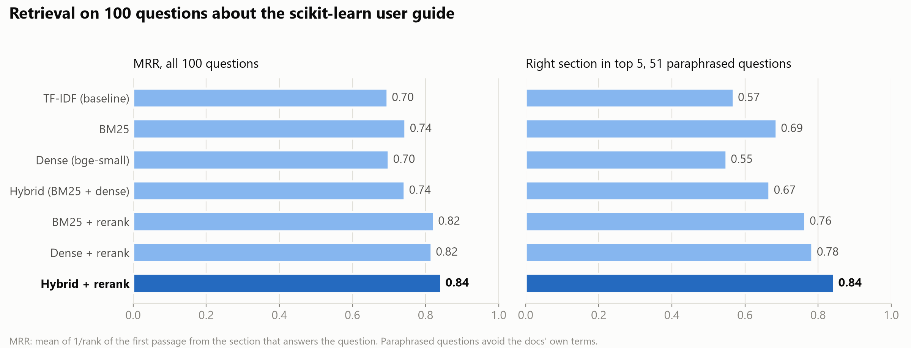
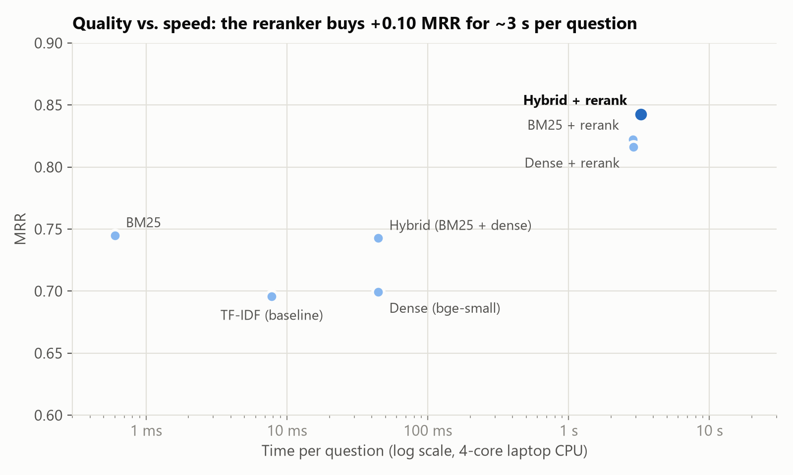

# RAG Document Q&A — Ask Your Docs

> A small but complete **Retrieval-Augmented Generation** app: it retrieves the
> most relevant passages from your documents and answers questions with
> **Claude**, grounded in the sources and cited by number. Runs offline with an
> extractive fallback when no API key is set. Ships with the full
> **scikit-learn user guide** (44 pages, ~140k words) as its knowledge base and a
> 100-question retrieval eval.


---

## What it does

Ask a question over a folder of documents and get a grounded, cited answer:

```bash
python -m docqa.ask "How does gradient boosting handle missing values?" --show-sources
```

With `ANTHROPIC_API_KEY` set, Claude synthesizes a grounded answer and cites the
passages (wording will vary — this is an illustrative example of the format):

```
A: HistGradientBoostingClassifier and HistGradientBoostingRegressor support NaNs
natively: at each split the tree learns whether samples with missing values go
left or right, based on the gain [1]. If a feature had no missing values during
training, such samples go to the child with the most samples [1].

[mode: claude]
```

With **no key**, the app answers in extractive mode (verbatim from the docs).
This is the output with the full retrieval stack (hybrid search + reranker; the
passage is trimmed here):

```
Q: How does gradient boosting handle missing values?

A: Ensembles: Gradient boosting, random forests, bagging, voting, stacking > Gradient-boosted trees > Histogram-Based Gradient Boosting > Missing values support. `HistGradientBoostingClassifier` and
`HistGradientBoostingRegressor` have built-in support for missing
values (NaNs).

During training, the tree grower learns at each split point whether samples
with missing values should go to the left or right child, based on the
potential gain. [...]

[mode: extractive]

Sources (most relevant first):
  [1] ensemble.md  (score 5.1687)
  [2] ensemble.md  (score 5.1496)
  [3] ensemble.md  (score 3.6404)
  [4] ensemble.md  (score 3.0114)
```

Keyword search alone (BM25, what you get without the `transformer` extra) ranks
the *Categorical Features Support* section first for this question, because it
shares more words with it; the reranker, which reads question and passage
together, puts *Missing values support* on top.

The knowledge base is the scikit-learn user guide, committed in
[`data/sklearn/`](data/sklearn) so the app works the moment you clone it. Point
`RAG_DOCS_DIR` (or `ingest --docs`) at your own `.md` / `.txt` files to use
those instead; see [`data/README.md`](data/README.md).

---

## How it works

The retrieval stack production RAG systems use, kept small enough to read in
one sitting:

```
documents ─► chunk (heading-aware) ─┬─► BM25 index ─────────┐
                                     └─► bge-small vectors ──┤
                                                             │
question ─► BM25 top ranks ─┐                                │
        └─► dense top ranks ┴─► reciprocal rank fusion ─► top 20 candidates
                                                             │
                              cross-encoder reranker (reads question + passage together)
                                                             │
                                             top 4 passages ─► Claude (grounded + cited)
```

1. **Chunk** (`chunk.py`) — split docs along their headings, packing short
   paragraphs of the same section together (up to 200 words per chunk, long
   ones windowed with overlap). Every chunk starts with its heading path, e.g.
   *Cross-validation > Cross validation iterators > K-fold*, so it keeps its
   context wherever it lands.
2. **Retrieve** (`retrieve.py`, `store.py`) — two complementary searches:
   - **BM25** — keyword matching (Okapi BM25). Exact on API names like
     `HistGradientBoostingClassifier`; no downloads.
   - **Dense** — [sentence-transformers](https://sbert.net) embeddings
     (`BAAI/bge-small-en-v1.5`, a BERT fine-tuned for retrieval) that match
     meaning even when the words differ.

   Their rankings are merged with **reciprocal rank fusion** (RRF), which uses
   only ranks, so the two score scales never need calibrating.
3. **Rerank** — a **cross-encoder** (`ms-marco-MiniLM-L6-v2`) rescores the top
   20 fused candidates. Unlike the embedding model, which encodes question and
   passage separately, it reads them together, so attention connects each word
   of the question with each word of the passage. That is more accurate, and
   too slow to run on every chunk, hence the two stages. Its score is also a
   usable relevance signal (see below).
4. **Generate** (`generate.py`) — the top passages are put in the prompt and
   **Claude** answers using only them, citing sources. No key? It falls back
   to an **extractive** answer (the top passage) so the app still runs.

Without the optional `transformer` extra, the app runs BM25 alone: no torch,
no model downloads.

**Why grounding matters:** answers are tied to retrieved evidence (less
hallucination), stay current without retraining, and are auditable through
citations.

---

## Quickstart

```bash
pip install -e ".[dev,transformer]"          # full stack; drop ",transformer" for BM25 only
python -m docqa.ingest                       # build the index (~4 min on a laptop CPU; BM25-only: seconds)
python -m docqa.ask "How does gradient boosting handle missing values?" --show-sources
python -m docqa.evaluate                     # retrieval metrics on the eval set
pytest -q
```

**Enable Claude answers** — set your key (the app reads it from the environment
and never stores it):

```bash
export ANTHROPIC_API_KEY=sk-ant-...          # Windows: setx ANTHROPIC_API_KEY ...
python -m docqa.ask "Why can accuracy be misleading on imbalanced data?"
```

**The web UI** is an optional extra too:

```bash
pip install -e ".[ui]" && python app.py      # Gradio chat demo
```

The generation model defaults to **`claude-opus-5`**; override with `RAG_MODEL`
(e.g. `RAG_MODEL=claude-haiku-4-5` for a cheaper, faster answer). If a Claude
call fails (bad key, unknown model, network), the app still answers extractively
and prints the reason as a `Note:`.

**Off-topic questions.** Passages the reranker scores below `-7` are dropped;
if none remain, the app says "I couldn't find anything relevant" and makes no
Claude call. On the eval set, every question's best passage scores above
`-5.9`, while 10 of 12 off-topic questions ("Who won the 2022 World Cup?")
score below `-8.4`. Without the reranker there's no reliable cut: similarity
scores of on- and off-topic questions overlap on this corpus, so BM25 only
drops questions that share no words with the docs. Tune it with `RAG_MIN_SCORE`.

**All settings** (environment variables, see `src/docqa/config.py`):

| variable | default | what it does |
|---|---|---|
| `RAG_MODEL` | `claude-opus-5` | Claude model for answers |
| `RAG_MAX_TOKENS` | `16000` | answer token cap (thinking counts toward it) |
| `RAG_BACKEND` | `auto` | `hybrid` (with the `transformer` extra) or `bm25`; also `tfidf`, `transformer` |
| `RAG_RERANK` | `auto` | cross-encoder reranking: on with the `transformer` extra; `0`/`1` to force |
| `RAG_RERANK_MODEL` | `cross-encoder/ms-marco-MiniLM-L6-v2` | any sentence-transformers cross-encoder |
| `RAG_RERANK_CANDIDATES` | `20` | fused candidates passed to the reranker |
| `RAG_TOP_K` | `4` | passages given to Claude |
| `RAG_MIN_SCORE` | per score type (reranker `-7`) | relevance threshold |
| `RAG_EMBED_MODEL` | `BAAI/bge-small-en-v1.5` | any sentence-transformers model, for dense retrieval |
| `RAG_DOCS_DIR` | `<data dir>/sklearn` | the documents to index |
| `RAG_DATA_DIR` | `<repo>/data` | folder holding the corpus, eval set and `index.joblib`; set it when installed with a regular `pip install .` |

---

## Evaluation

`data/sklearn_eval.jsonl` holds 100 questions about the scikit-learn user guide,
each labeled with the page and section that answers it: 49 phrased with the
guide's own terms ("keyword") and 51 describing the need in other words
("paraphrase"). They were written by Claude from the section text and
spot-checked against it.

```bash
python -m docqa.evaluate --json docs/eval_results.json   # every installed method
python -m docqa.report docs/eval_results.json            # redraw the charts (`report` extra)
```

A retrieved chunk is a **page hit** if it comes from the right page and a
**section hit** if it also sits in the right section; **MRR** is the mean of
1/rank of the first section hit. Results (1,003 chunks; latency on a 4-core
laptop CPU, i7-8550U):

| method | page@1 | section@1 | section@3 | section@5 | MRR | paraphrase section@5 | ms/query |
|---|---|---|---|---|---|---|---|
| TF-IDF (where this started) | 0.76 | 0.64 | 0.74 | 0.78 | 0.70 | 0.57 | 8 |
| BM25 | 0.83 | 0.68 | 0.81 | 0.84 | 0.74 | 0.69 | 1 |
| dense (bge-small) | 0.84 | 0.65 | 0.74 | 0.77 | 0.70 | 0.55 | 44 |
| hybrid (BM25 + dense, RRF) | 0.89 | 0.69 | 0.78 | 0.83 | 0.74 | 0.67 | 44 |
| BM25 + rerank | 0.91 | 0.79 | 0.86 | 0.88 | 0.82 | 0.76 | 2,857 |
| dense + rerank | 0.89 | 0.77 | 0.87 | 0.89 | 0.82 | 0.78 | 2,885 |
| **hybrid + rerank (default)** | **0.91** | **0.80** | **0.88** | **0.92** | **0.84** | **0.84** | 3,266 |





What the numbers say:

- **BM25 beats TF-IDF** on every metric (MRR 0.70 → 0.74, paraphrases 0.57 →
  0.69), at no cost, so it is the default when the extra isn't installed.
- **Fusion on its own barely moves the top ranks** (MRR 0.74, like BM25), but it
  finds the right page far more often (0.89) and puts the right section in the
  top 20 for 96% of questions, against 90–92% for either search alone. That's
  what the reranker needs: with fused candidates it reaches 0.84 on
  paraphrases, against 0.76 when BM25 alone supplies them.
- **The reranker is the big step**: section@1 0.69 → 0.80, MRR 0.74 → 0.84. It
  is also the cost: ~3 s per question on a laptop CPU, almost all of it in the
  cross-encoder.

It doesn't fix everything. For *"How do I keep class proportions equal across
CV folds?"* the top hit is still the *Group K-fold* section (it mentions class
proportions and points to `StratifiedGroupKFold`, the second hit) rather than
*Stratified K-fold*.

### Answer quality: Claude as the judge

Retrieval metrics say whether the right passage was found; they don't say
whether the final answer is faithful to it. `docqa.judge` runs the full
pipeline on each eval question and has a second Claude call grade the answer
against the retrieved passages and the question's reference answer, with a
fixed JSON schema:

| field | question it answers |
|---|---|
| `support` (`all`/`most`/`some`/`none`) | Are the answer's claims backed by the passages? (faithfulness) |
| `answers_question` | Does it answer what was asked? |
| `matches_reference` | Does it agree with the reference answer written with the question? |
| `citations_valid` | Does every `[n]` point at a passage that says what it's cited for? |
| `says_not_found` | Did it say the passages don't contain the answer? |

```bash
python -m docqa.judge --limit 10                 # a cheap first look
python -m docqa.judge --json judged.json         # all 100; prints rates and token cost
```

Each verdict comes with the judge's reason and the unsupported claims, so any
grade can be checked by hand. The judge is the same model family as the
answerer, which can flatter it; spot-checking the reasons is part of the job.

**Chunking was chosen on this set too** (MRR, TF-IDF / bge-small):

| chunking | chunks | MRR |
|---|---|---|
| one paragraph per chunk | 4,358 | 0.59 / 0.67 |
| sections packed to 80 words | 2,504 | 0.63 / 0.68 |
| sections packed to 120 words | 1,642 | 0.63 / 0.66 |
| **sections packed to 200 words** | **1,003** | **0.70 / 0.70** |
| sections packed to 250 / 300 words | 854 / 755 | 0.67 / 0.69 (TF-IDF) |

## Project structure

```
rag-document-qa/
├── data/
│   ├── sklearn/*.md             # the knowledge base: scikit-learn user guide
│   ├── sklearn_eval.jsonl       # 100 labeled questions (page + section)
│   └── ml_notes/*.md            # tiny corpus for fast tests
├── scripts/fetch_sklearn_docs.py  # rebuilds data/sklearn from a pinned release
├── src/docqa/
│   ├── config.py                # paths, backend, model, chunk params
│   ├── chunk.py                 # heading-aware chunking
│   ├── embed.py                 # TF-IDF and sentence-transformers embedders
│   ├── retrieve.py              # BM25, cosine scorers, RRF, cross-encoder reranker
│   ├── store.py                 # build / persist / search (fuse + rerank) the index
│   ├── generate.py              # Claude answer + extractive fallback
│   ├── pipeline.py              # retrieve -> generate
│   ├── evaluate.py              # retrieval metrics on the eval set
│   ├── judge.py                 # answer quality, graded by Claude
│   ├── report.py                # charts of the retrieval eval
│   ├── ingest.py  ask.py        # CLIs
├── docs/                        # eval results (JSON) and the charts made from them
├── app.py                       # optional Gradio UI
├── tests/  .github/workflows/  pyproject.toml
```

## Design notes & honesty

- **Measured, not assumed.** Every retrieval choice here (BM25 over TF-IDF,
  chunk size, fusion, reranking, candidate count, the relevance threshold) was
  picked on the eval set, and the tables above are the evidence.
- **Defaults kept standard to avoid overfitting 100 questions.** BM25 uses
  the textbook k1=1.5, b=0.75 and RRF the paper's k=60. Tuning them on the eval
  set scored slightly higher (e.g. RRF k=20), but that would only fit these
  questions. The relevance threshold was calibrated on the same questions, so it
  sits well below the lowest on-topic score.
- **Why MiniLM for reranking.** `ms-marco-MiniLM-L6-v2` (22M params) takes ~3 s
  per question on a laptop CPU for 20 candidates. `mxbai-rerank-xsmall-v1` was
  over 5× slower on the same CPU, too slow for the CPU-only demo, so its
  accuracy wasn't measured; `bge-reranker-base` is 4× larger again and wasn't
  tried.
- **Why bge-small for embeddings.** On the 24 labeled questions about the ML
  notes in `tests/test_rag.py`, recall@1 was: TF-IDF 12 + 9, `all-MiniLM-L6-v2`
  12 + 11, `bge-small-en-v1.5` 12 + 12, and a raw mean-pooled BERT-mini (the
  original dense backend) 9 + 8.
- **Light install still works.** Without the `transformer` extra (torch and
  the models), `auto` falls back to BM25, which has no model downloads.
- **In-memory store.** Fine for a small knowledge base; the `store.search`
  interface swaps cleanly to FAISS or a vector DB for scale.
- **Extractive fallback is a feature, not a stub** — it keeps the app runnable
  and CI green without an API key, and gives a sensible answer offline.
- **Keys are never persisted** — the Anthropic SDK reads `ANTHROPIC_API_KEY`
  from the environment; this code doesn't log or store it.

## License

[MIT](LICENSE) © Ahmed Fawzy Yahya
